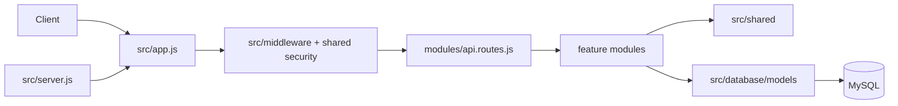
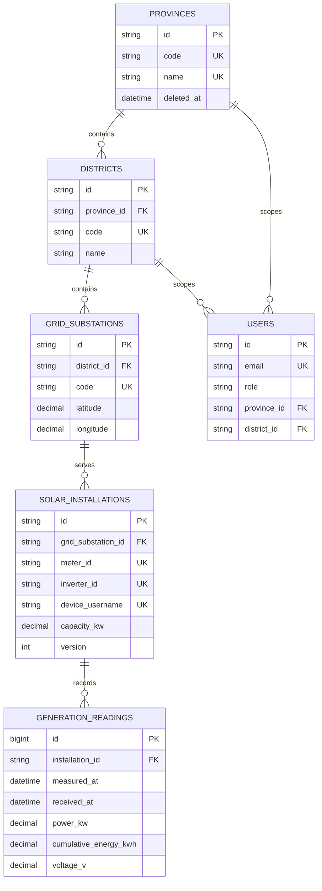

# Architecture and ER diagram

## Layered modular monolith

The API is one stateless Express deployable organised by business feature. `src/app.js` owns cross-cutting HTTP middleware and Swagger, while `src/server.js` owns process startup and graceful shutdown. `src/modules/api.routes.js` is the composition root for feature route modules. Each feature follows the same dependency direction:

```text
routes -> controllers -> services -> repositories -> database/models
              |             |
              +-> serializers/schemas
shared cross-cutting concerns (HTTP, security, validation, time, logging)
```

Routes only declare URLs and middleware. Controllers translate HTTP requests into use-case calls and responses. Services contain business rules and orchestration. Repositories are the only feature layer that queries Sequelize models. Serializers keep public representations separate from persistence models.

The implemented layout is:

```text
src/
├── app.js, server.js
├── config/
├── middleware/
├── database/
│   ├── models/
│   ├── migrations/
│   └── seeders/
├── modules/
│   ├── auth/
│   ├── provinces/
│   ├── districts/
│   ├── substations/
│   ├── installations/
│   ├── readings/
│   └── summaries/
└── shared/
    ├── http/
    ├── security/
    ├── validation/
    └── utils/
```

Every business feature contains its own `*.routes.js`, `*.controller.js`, `*.service.js`, and `*.repository.js`; response-heavy features also contain a `*.serializer.js`.

The feature modules are:

- `src/modules/auth/` — user and installation authentication
- `src/modules/provinces/` — province read and maintenance endpoints
- `src/modules/districts/` — district read, maintenance, and nested resources
- `src/modules/substations/` — grid-substation read and maintenance endpoints
- `src/modules/installations/` — installation metadata and overview endpoints
- `src/modules/readings/` — append-only generation reading queries and device ingestion
- `src/modules/summaries/` — district generation summaries

Each feature is independently understandable without creating a second deployable. Database concerns are under `src/database/` (models, migrations, and seeders). Request/error middleware is under `src/middleware/`; shared security, validation, time, logging, and representation helpers are under `src/shared/`.

## Runtime flow



## ER diagram



Foreign keys do not cascade deletes. Metadata deletion is a soft delete, while readings are append-only and protected by both application policy and database triggers.
