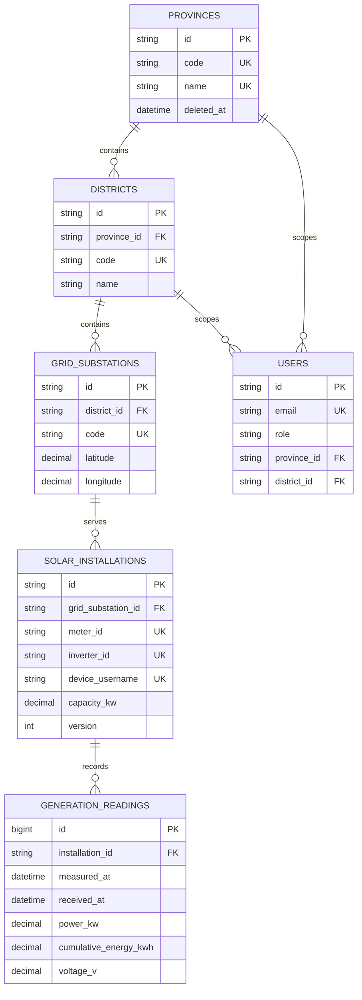

# Architecture and ER diagram

## Components

The API is a single stateless Express process. `src/app.js` owns HTTP middleware and Swagger; `src/routes/api.js` owns resource handlers; Sequelize models and explicit Umzug migrations own persistence; the seed script creates synthetic demonstration data. JWTs identify either a user or a device. Every protected request rechecks the active subject in MySQL.

## ER diagram

Foreign keys do not cascade deletes. Metadata deletion is a soft delete, while readings are append-only and protected by both application policy and database triggers.
